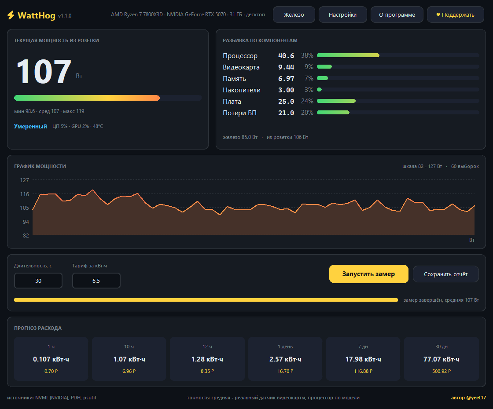
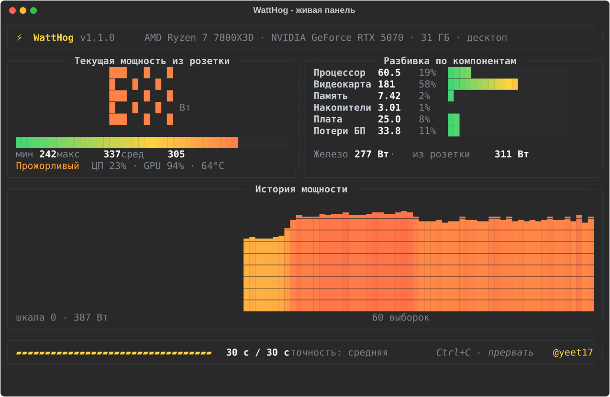
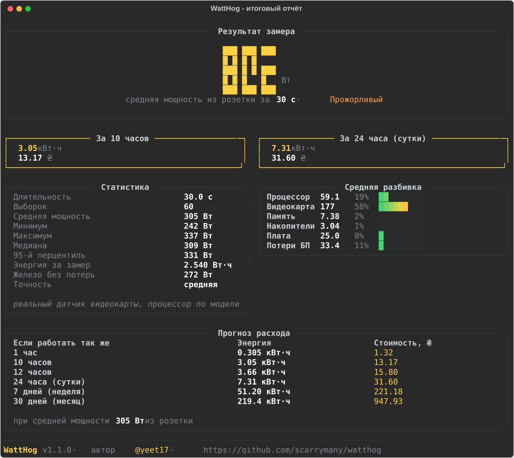
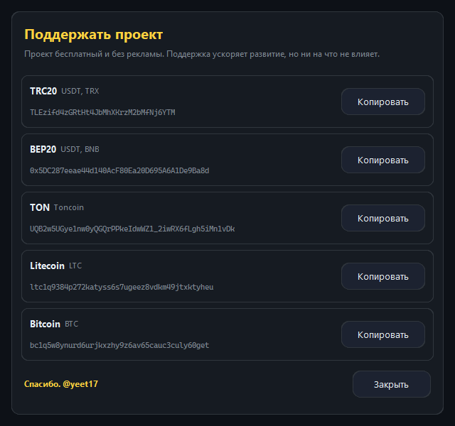

<div align="center">


# WattHog

**Сколько ватт твой компьютер съедает прямо сейчас и во что это выльется за сутки**

[](https://github.com/scarrymany/watthog/releases/latest)
[](https://github.com/scarrymany/watthog/actions/workflows/ci.yml)
[](https://github.com/scarrymany/watthog/releases)
[](LICENSE)
[](#установка)
[](https://t.me/yeet17)
[](DONATE.md)

[Установка](#установка) · [Два интерфейса](#два-интерфейса) · [Как пользоваться](#как-пользоваться) · [Как это работает](#как-это-работает) · [Точность](#точность) · [Поддержать](#поддержать-проект) · [English](README.en.md)



</div>

---

## Что это

Розеточный ваттметр стоит денег и лежит не у всех. WattHog решает ту же задачу программно:
запускается на минуту, снимает телеметрию железа два раза в секунду и отвечает на вопрос,
который обычно задают перед оплатой счёта за электричество.

Программа не гадает по одной цифре TDP. Там, где у железа есть настоящий датчик мощности,
берётся его показание. Всё остальное достраивается физической моделью, а в отчёте честно
написано, какая часть результата измерена, а какая посчитана.

```
                  Средняя мощность за минуту: 308 Вт

  за 1 час     0.308 кВт·ч        за 12 часов    3.70 кВт·ч
  за 10 часов  3.08  кВт·ч        за 24 часа     7.39 кВт·ч
```

## Возможности

| | |
|---|---|
| 🪟 **Два интерфейса** | Окно без консоли и полноценный текстовый интерфейс в терминале - на выбор |
| ⚡ **Реальные датчики** | NVML для видеокарт NVIDIA, RAPL для процессора в Linux, hwmon для AMD и Intel, разряд батареи на ноутбуке |
| 📊 **Живые показания** | Текущая мощность крупно, разбивка по компонентам, график за всё время замера |
| 🧮 **Прогноз расхода** | Час, 10 часов, 12 часов, сутки, неделя, месяц - в киловатт-часах и в деньгах по вашему тарифу |
| 🔌 **Считает от розетки** | К потреблению железа добавляются потери блока питания по кривой КПД, а не по одному коэффициенту |
| 🖥 **Windows и Linux** | Десктопы, ноутбуки, мини-ПК. Права администратора не нужны |
| 📦 **Один файл** | Готовые сборки без установки и без Python. Или `pip install`, если так удобнее |
| 📁 **Отчёты в JSON** | Каждый замер сохраняется целиком: статистика, разбивка, железо, источники данных |
| 🎛 **Калибровка** | Знаете реальные цифры своей системы - впишите их в настройки, и модель станет точнее |

## Два интерфейса

Обе версии считают абсолютно одинаково: у них общий движок замера, общая модель мощности
и общий формат отчёта. Отличается только подача.

<table>
<tr>
<td width="50%" valign="top">

**Оконная версия** - `WattHog-GUI.exe`

Запускается двойным кликом, консоли нет. Крупные показания, кнопка запуска, копирование
адресов поддержки в один клик.

</td>
<td width="50%" valign="top">

**Консольная версия** - `WattHog.exe`

Живая панель прямо в терминале, меню, работа по SSH и в скриптах. Есть ключи командной
строки и вывод отчёта в JSON.

</td>
</tr>
</table>

<div align="center">

</div>

## Установка

### Windows: одна команда

```powershell
irm https://raw.githubusercontent.com/scarrymany/watthog/main/install.ps1 | iex
```

Скачает последнюю сборку в `%LOCALAPPDATA%\Programs\WattHog` и добавит её в `PATH`.
Права администратора не нужны. После установки откройте новый терминал и наберите `WattHog`.

<details>
<summary>Или скачать нужный файл вручную</summary>

Оконная версия, без консоли:

```powershell
curl.exe -L -o WattHog-GUI.exe https://github.com/scarrymany/watthog/releases/latest/download/WattHog-GUI.exe
```

Консольная версия:

```powershell
curl.exe -L -o WattHog.exe https://github.com/scarrymany/watthog/releases/latest/download/WattHog.exe
```

Файлы самодостаточные: Python и библиотеки внутри.
</details>

### Linux: одна команда

```bash
curl -fsSL https://raw.githubusercontent.com/scarrymany/watthog/main/install.sh | bash
```

Поставит через `pipx`, а если его нет - в отдельное окружение в `~/.local/share/watthog`
со ссылкой в `~/.local/bin`. Появятся обе команды: `watthog` и `watthog-gui`.

<details>
<summary>Или готовые бинарники без Python</summary>

```bash
curl -fsSL -o watthog https://github.com/scarrymany/watthog/releases/latest/download/watthog-linux-x86_64
curl -fsSL -o watthog-gui https://github.com/scarrymany/watthog/releases/latest/download/watthog-gui-linux-x86_64
chmod +x watthog watthog-gui
./watthog
```
</details>

### Через pip или pipx

```bash
pipx install git+https://github.com/scarrymany/watthog.git
# или
pip install git+https://github.com/scarrymany/watthog.git
```

В Linux оконной версии нужен системный пакет `python3-tk`:

```bash
sudo apt install python3-tk     # Debian, Ubuntu
sudo dnf install python3-tkinter # Fedora
```

### Из исходников

```bash
git clone https://github.com/scarrymany/watthog.git
cd watthog
pip install -e ".[dev]"
python -m watthog          # консольная версия
python -m watthog.gui      # оконная версия
```

> **macOS не поддерживается.** Там нет ни RAPL, ни аналога счётчиков PDH, а без них
> измерять нечем - честной цифры не получится, а рисовать выдуманную программа не будет.

## Как пользоваться

### Окно

```bash
watthog-gui        # или двойной клик по WattHog-GUI.exe
watthog gui        # то же самое из консольной версии
```

Впишите длительность и тариф, нажмите «Запустить замер». Во время замера кнопка
превращается в «Остановить», уже собранные выборки при этом не теряются.

### Консоль

Без аргументов открывается меню:

```bash
watthog
```

Или сразу замером:

```bash
watthog run                          # 60 секунд, живая панель
watthog run -d 300                   # пять минут
watthog run --tariff 6.5             # сразу посчитать деньги
watthog run --plain --no-save        # только текст, ничего не сохранять
watthog run --json report.json       # выгрузить отчёт в файл
watthog info                         # что за железо и какие датчики доступны
watthog config                       # настройки
```

<details>
<summary>Все ключи командной строки</summary>

| Ключ | Что делает |
|---|---|
| `-d`, `--duration СЕК` | Длительность замера, по умолчанию 60 |
| `-i`, `--interval СЕК` | Интервал между выборками, по умолчанию 0.5 |
| `--tariff ЦЕНА` | Цена киловатт-часа для расчёта затрат |
| `--currency ЗНАК` | Обозначение валюты в отчёте |
| `--json ФАЙЛ` | Сохранить отчёт по указанному пути |
| `--no-save` | Не писать отчёт в каталог отчётов |
| `--plain` | Без живой панели, только текстовый вывод |
| `--save-config` | Записать переданные параметры в настройки |
| `-V`, `--version` | Версия |

</details>

### Итоговый отчёт в консоли

<div align="center">

</div>

## Как это работает

Каждые полсекунды снимается срез телеметрии, из него считается мощность каждого узла,
а в конце значения интегрируются в энергию по методу трапеций.

### Источники данных

| Узел | Откуда берутся ватты | Точность |
|---|---|---|
| Видеокарта NVIDIA | NVML напрямую через `nvml.dll` / `libnvidia-ml.so` | **измерено** |
| Видеокарта AMD, Intel | `hwmon` в Linux: `power1_average` или `energy1_input` | **измерено** |
| Процессор в Linux | RAPL: прирост счётчика энергии `/sys/class/powercap` | **измерено** |
| Вся система на ноутбуке | Мгновенная мощность разряда батареи | **измерено** |
| Процессор в Windows | Модель по загрузке и множителю частоты из счётчика PDH | расчёт |
| Видеокарта без датчика | Модель по загрузке движков GPU | расчёт |
| Память, накопители, плата | Модель по объёму, потоку ввода-вывода и типу платформы | расчёт |
| Потери блока питания | Кривая КПД 80 PLUS от доли нагрузки | расчёт |

Если доступно прямое измерение всей системы (батарея или домен RAPL `psys`), оценки
компонентов пропорционально подгоняются под него: сумма становится точной, а разбивка
остаётся информативной.

### Модель процессора

```
P = P_простой + (P_пик - P_простой) · загрузка^0.55 · (частота / 1.05)
```

Показатель степени меньше единицы не случаен. Первые нагруженные ядра стоят дороже
последних: на одном активном ядре процессор держит максимальный буст и высокое
напряжение, а при полной загрузке частоты и напряжения падают. Множитель частоты берётся
из счётчика `% Processor Performance`, который показывает реальный клок относительно
номинального - именно он отличает лёгкую однопоточную нагрузку от тяжёлой многопоточной.

Мощность пакета делится на КПД VRM материнской платы: датчик процессора этих потерь
не видит, а из розетки они берутся.

### Встроенная графика

Встроенная графика питается от того же кристалла, что и процессор, поэтому её мощность
**не** считается отдельно - иначе получился бы двойной учёт. Программа распознаёт
интегрированные адаптеры по имени и исключает их, а виртуальные адаптеры вроде
`Microsoft Basic Display Adapter` игнорирует полностью.

### Блок питания

Из розетки берётся больше, чем едят железки: разница уходит в тепло на блоке питания.
КПД считается не константой, а по кривой 80 PLUS в зависимости от доли нагрузки от
номинала - при 20% нагрузки блок работает заметно хуже, чем при 50%.

## Точность

Программа не притворяется ваттметром и в каждом отчёте пишет, на что опирается результат.

| Уровень | Когда | Насколько близко к розетке |
|---|---|---|
| **измерено** | Ноутбук от батареи или домен RAPL `psys` | Отклонение в пределах единиц процентов |
| **высокая** | Есть датчики и процессора, и видеокарты | Обычно 5-10% |
| **средняя** | Есть датчик видеокарты, процессор по модели | Обычно 10-20% |
| **расчётная** | Датчиков нет, всё по модели | Порядок величины, 20-35% |

Что реально повышает точность:

1. **Впишите номинал и класс блока питания** в настройках. Кривая КПД станет вашей, а не усреднённой.
2. **Задайте пик процессора и видеокарты**, если знаете их по обзорам или своему мониторингу.
3. **Укажите периферию** - монитор, колонки, всё, что воткнуто в ту же розетку.
4. **В Linux запустите через `sudo`** - откроется RAPL, и процессор станет измеренным, а не расчётным.

Есть ваттметр и цифры расходятся? [Пришлите замер](https://github.com/scarrymany/watthog/issues/new?template=accuracy_report.yml) -
такие отчёты напрямую улучшают справочник и модель.

## Настройки

Меняются в окне (кнопка «Настройки»), в консольном меню (`watthog config`) и лежат в JSON:

- Windows: `%APPDATA%\WattHog\config.json`
- Linux: `~/.config/watthog/config.json`

| Настройка | По умолчанию | Зачем |
|---|---|---|
| `duration_seconds` | 60 | Длительность замера |
| `sample_interval` | 0.5 | Интервал между выборками |
| `tariff_per_kwh` | 0 | Цена киловатт-часа |
| `currency` | ₽ | Обозначение валюты |
| `psu_peak_efficiency` | 0.90 | Пиковый КПД блока питания: Bronze 0.85, Gold 0.90, Platinum 0.92 |
| `psu_rated_watts` | 650 | Номинал блока питания |
| `extra_devices_watts` | 0 | Монитор, колонки и прочая периферия |
| `cpu_peak_watts` | авто | Мощность процессора под полной нагрузкой |
| `gpu_peak_watts` | авто | Мощность видеокарты под полной нагрузкой |
| `platform_watts` | авто | Плата, вентиляторы, обвязка |
| `save_reports` | true | Сохранять отчёты автоматически |

## Отчёты

Каждый замер сохраняется в `%APPDATA%\WattHog\reports` или `~/.config/watthog/reports`.

<details>
<summary>Структура JSON</summary>

```json
{
  "app": "WattHog",
  "version": "1.1.0",
  "started_at": "2026-08-09T14:21:07",
  "duration_seconds": 60.0,
  "sample_count": 120,
  "accuracy": "средняя",
  "power_watts": {
    "average_from_wall": 308.2,
    "average_components": 274.6,
    "minimum": 290.1,
    "maximum": 324.4,
    "median": 311.0,
    "percentile95": 315.2
  },
  "energy_wh": 5.137,
  "breakdown_watts": {
    "Процессор": 73.7,
    "Видеокарта": 165.0,
    "Память": 7.91,
    "Накопители": 3.0,
    "Плата": 25.0,
    "Потери БП": 33.7
  },
  "projections": [
    { "hours": 10.0, "label": "10 часов", "kwh": 3.082, "cost": null }
  ],
  "hardware": { "cpu": "AMD Ryzen 7 7800X3D", "gpus": [] },
  "sources": [{ "name": "NVML (NVIDIA)", "active": true }]
}
```

</details>

## Сборка

```bash
git clone https://github.com/scarrymany/watthog.git
cd watthog
pip install -e ".[dev]"

python -m pytest                                          # тесты
python tools/make_icon.py                                 # иконка
python -m PyInstaller --noconfirm --clean packaging/watthog.spec
```

В `dist/` появятся оба файла: консольный и оконный. Релизные сборки для Windows и Linux
собирает [GitHub Actions](.github/workflows/release.yml) по тегу.

## Вопросы

<details>
<summary>Чем оконная версия отличается от консольной?</summary>

Только подачей. Движок замера, модель мощности и формат отчёта у них общие, поэтому
цифры совпадают до последнего знака. Оконная версия удобнее на своём компьютере,
консольная - по SSH и в скриптах.
</details>

<details>
<summary>Почему цифра отличается от того, что показывает MSI Afterburner?</summary>

Afterburner показывает мощность видеокарты, а WattHog - всей системы из розетки: плюс
процессор, память, накопители, плата и потери блока питания. Мощность видеокарты в
разбивке должна совпадать с Afterburner до ватта, потому что берётся из того же NVML.
</details>

<details>
<summary>Нужны ли права администратора?</summary>

В Windows нет. В Linux без `sudo` всё работает, но счётчик RAPL на большинстве
дистрибутивов закрыт от обычного пользователя, и мощность процессора считается моделью.
С `sudo` она становится измеренной.
</details>

<details>
<summary>Почему встроенная видеокарта показывает ноль?</summary>

Так и должно быть. Она питается от кристалла процессора, и её потребление уже входит в
строку «Процессор». Считать её отдельно значило бы посчитать одни и те же ватты дважды.
</details>

<details>
<summary>Можно ли мерить дольше минуты?</summary>

Да, `watthog run -d 3600` измеряет час, в окне достаточно вписать нужное число секунд.
Минута - разумное значение по умолчанию: этого хватает, чтобы усреднить дрожание
нагрузки, и не приходится долго ждать.
</details>

<details>
<summary>Программа что-нибудь отправляет в сеть?</summary>

Нет. Ни телеметрии, ни проверки обновлений, ни единого сетевого запроса. Всё считается
локально, отчёты остаются на диске.
</details>

## Поддержать проект

Программа бесплатная, с открытым кодом, без рекламы и без сбора данных. Если она
оказалась полезной, поддержать можно криптовалютой:

| Сеть | Монеты | Адрес |
|---|---|---|
| **TRC20** | USDT, TRX | `TLEzifd4zGRtHt4JbMhXKrzM2bMfNj6YTM` |
| **BEP20** | USDT, BNB | `0x5DC287eeae44d140AcF80Ea20D695A6A1De9Ba8d` |
| **TON** | Toncoin | `UQB2w5UGye1nw0yQGQrPPkeIdwWZ1_2iwRX6fLgh5iMn1vDk` |
| **Litecoin** | LTC | `ltc1q9384p272katyss6s7ugeez8vdkm49jtxktyheu` |
| **Bitcoin** | BTC | `bc1q5w8ynurd6urjkxzhy9z6av65cauc3culy60get` |

Те же реквизиты есть внутри программы: в окне это кнопка **♥ Поддержать** с копированием
в буфер обмена, в консоли - пункт меню **7**. Подробности и способы помочь без денег -
в [DONATE.md](DONATE.md).

<div align="center">

</div>

## Вклад

Пул-реквесты приветствуются, особенно с замерами реального железа - см. [CONTRIBUTING.md](CONTRIBUTING.md).
Больше всего проекту помогают три вещи: строчки в справочнике мощности процессоров и
видеокарт, отчёты о расхождении с ваттметром и проверка на редком железе.

## Лицензия

[MIT](LICENSE) © 2026 [@yeet17](https://t.me/yeet17)

<div align="center">

Сделано [@yeet17](https://t.me/yeet17) · [Telegram](https://t.me/yeet17) · [Поддержать](DONATE.md)

Если программа оказалась полезной, поставьте звезду ⭐

</div>
